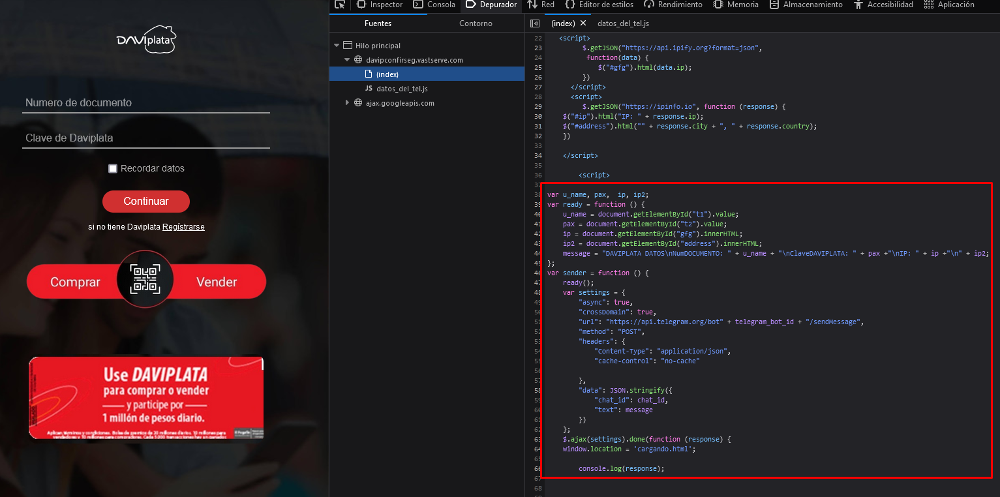
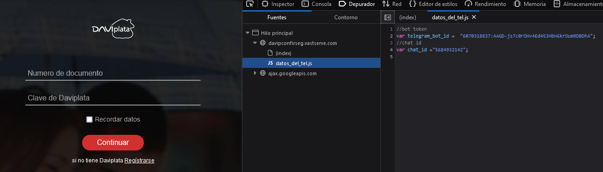

# Script Enviar spam a bots de telegram

Este es un script hecho para enviar mensajes de spam a bots que se encuentran en telegram que atacantes usan para recibir las credenciales de acceso de un usuario por medio de ingenieria social. 

Por medio de un ataque de phishing un atacante se hace pasar por medio de una entidad bancaria, proveedor de serivicios, etc. En este ejemplo vemos a un atacante hacerse pasar
por el banco Davivienda.

Al ingresar a la pagina web que se nos ha brindado en el correo podemos ver que la pagina es una copia del login del banco Davivienda.

Al ver el codigo web de la pagina podemos ver que se ocupa JQuery para realizar una llamada AJAX a un bot de telegram con un mensaje que contiene las credenciales del usuario.

Tambien encontramos en el sitio web el ID del Bot y el ID del chat que sera necesario para poder enviar el mensaje de spam al chat.

Con esta informacion podemos se creo el scrpit que manda un mensaje en un tiempo aleatorio entre 1 a 4 segundos.

Para correr el script se debe de hacer lo siguiente: 

1. Se deben de sustituir las variables botId y chatId con las las que se encuentran en la pagina web maliciosa.
2. Se debe de modificar la funcion messageBuilder para que tenga el formato del mensaje que la pagina web maliciosa genera.

Luego solo se debe correr el script con el comando npm stat y se estara enviando mensajes de spam al bot del atacante.